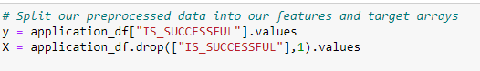
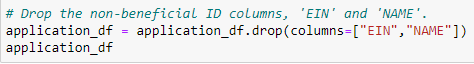

# Neural_Network_Charity_Analysis

## Overview:
With our knowledge of machine learning and neural networks, we’ll use the features in the provided dataset to create a binary classifier that is capable of predicting whether applicants will be successful if funded by Alphabet Soup.

## Results: 
- Data Preprocessing
  - What variable(s) are considered the target(s) for your model?
  
    The variable we'll use to is "IS_SUCCESSFUL". This variable (y) determines if the charity was successful with the funding.
    
  - What variable(s) are considered to be the features for your model?
    
    Every column in our dataset from "ASK_AMT", "APPLICATION_TYPE", "INCOME_AMT", and "SPECIAL_CONSIDERATION" will be our features (X).
    
 
 
  - What variable(s) are neither targets nor features, and should be removed from the input data?
  
    We have dropped EIN and NAME from our input data. Both are neither targets or features.
    
  
  
- Compiling, Training, and Evaluating the Model
  - How many neurons, layers, and activation functions did you select for your neural network model, and why?
  
  - Were you able to achieve the target model performance?
  
  - What steps did you take to try and increase model performance?
  
## Summary:
