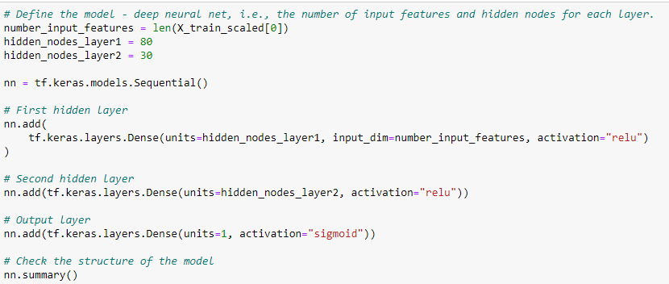

# Neural_Network_Charity_Analysis

## Overview:
With our knowledge of machine learning and neural networks, we’ll use the features in the provided dataset to create a binary classifier that is capable of predicting whether applicants will be successful if funded by Alphabet Soup.

## Results: 
- Data Preprocessing
  - What variable(s) are considered the target(s) for your model?
  
    The variable we'll use to is "IS_SUCCESSFUL". This variable (y) determines if the charity was successful with the funding.
    
  - What variable(s) are considered to be the features for your model?
    
    Every column in our dataset from "ASK_AMT", "APPLICATION_TYPE", "INCOME_AMT", and "SPECIAL_CONSIDERATION" will be our features (X).
    
 
 
  - What variable(s) are neither targets nor features, and should be removed from the input data?
  
    We have dropped EIN and NAME from our input data. Both are neither targets or features.
    
  
  
- Compiling, Training, and Evaluating the Model
  - How many neurons, layers, and activation functions did you select for your neural network model, and why?
  
  We selected two hidden layer with 80 neurons in the first layer and 30 in the second layer. We chose ReLu activation for the hidden layer and sigmoid for the output         because for binary classification, we can predict the output to be between 0 and 1.
  
  
  
  - Were you able to achieve the target model performance?
  We were not able to, just shy of 75%.
  
  
  
  - What steps did you take to try and increase model performance?
  For Deliverable 3 attempt 1, we selected only one hidden layer with 80 neurons, however we increased from 100 epochs to 150 epoches to see if we get a significant change. However, no significant difference between our initial model. 
  
  
  
  
  For Deliverable 3 attempt 2, we selected two hidden layers with 80 neurons and 30 neurons, however we changed the output activattion to tanh. We saw no significant difference between our initial model. 
  
  
  
  
  For Deliverable 3 attempt 3, we selected three hidden layer with 80 neurons, 40 neurons and 20 neurons. We saw no significant difference between our initial model. 
  
  
  
  
## Summary:
We were unable to acheive the accuracy of 75% or over for all 4 models. 
We can try to solve the problem using other models such as random forest. It is a simpler model and can be more effective depending on the dataset.
